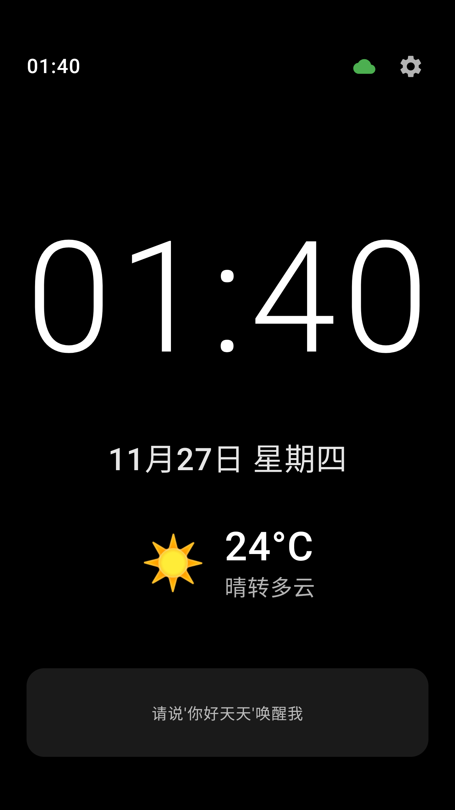
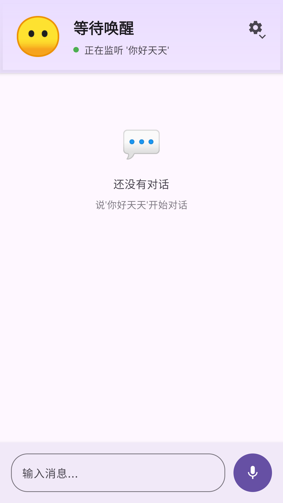
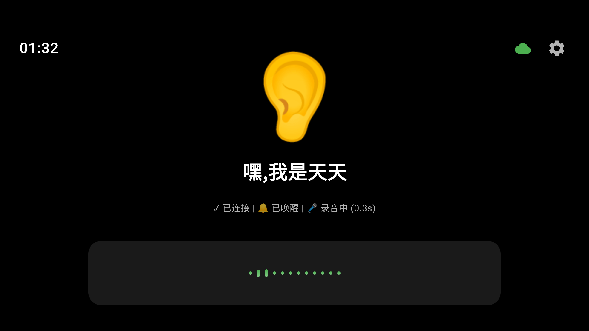
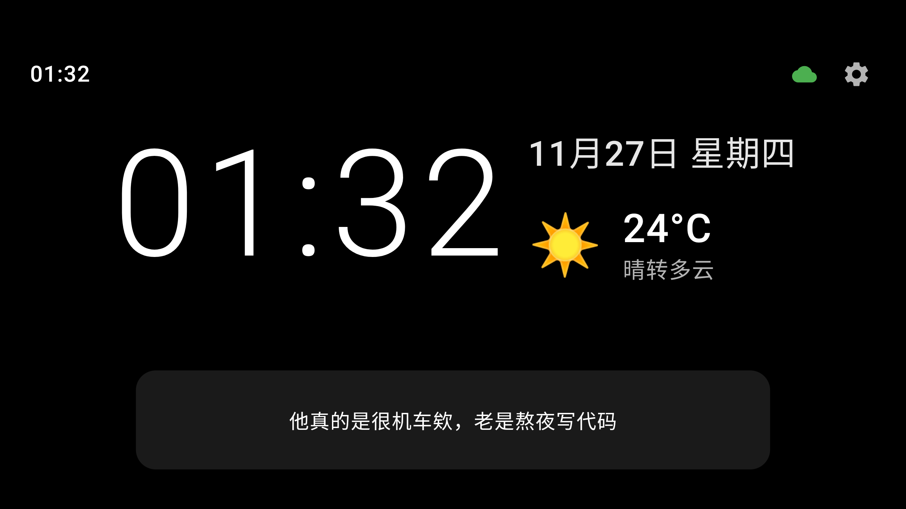
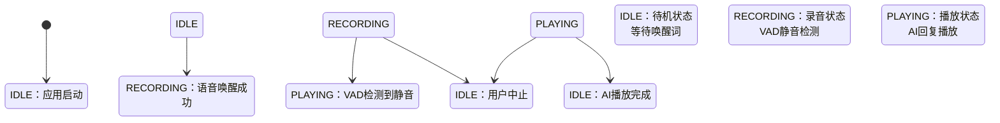

# 🎤 Lumi Assistant - 智能语音助手客户端

<div align="center">


**新一代智能语音助手客户端，专为桌面信息展示和个人助手场景设计**

[✨ 功能特性](#-功能特性) • [🚀 快速开始](#-快速开始) • [📱 应用场景](#-应用场景) • [🛠️ 技术架构](#️-技术架构) • [📖 开发指南](#-开发指南)

</div>

---

## 📸 应用截图

<div align="center">

### 🏠 待机模式 - 智能桌面信息牌
实时显示时间、日期、天气信息，完美融入桌面环境



### 💬 语音交互流程

<table>
  <tr>
    <td></td>
    <td></td>
    <td></td>
  </tr>
  <tr>
    <td align="center"><b>1️⃣ 等待唤醒</b><br/><i>监听"你好天天"唤醒词</i></td>
    <td align="center"><b>2️⃣ 语音识别</b><br/><i>实时录音和波形显示</i></td>
    <td align="center"><b>3️⃣ AI 回复</b><br/><i>语音合成和文字展示</i></td>
  </tr>
</table>

**核心功能展示**：
- 🎙️ 离线语音唤醒（"你好天天"）
- 🗣️ 实时语音识别与 VAD 静音检测
- 🤖 AI 智能对话与流式响应
- 🔊 语音合成播放
- 🕐 时钟 & 日期 & 天气信息展示
- 📊 实时音频波形可视化

</div>

---

## 📖 项目简介

**Lumi Assistant** 是一款基于 Android 的智能语音助手客户端，集成了先进的离线语音唤醒、实时语音识别和 AI 对话技术。本项目专为**桌搭、桌面信息牌、个人助手**等场景设计，提供流畅的语音交互体验和美观的界面展示。

### 🎯 核心定位

- **🏠 智能桌面助手**：完美融入桌面环境，提供便捷的语音服务
- **📱 桌面信息牌**：实时显示语音识别结果和 AI 回复，适合展示场景
- **🎤 小智语音**：支持离线唤醒，随时响应语音指令
- **🤖 个人 AI 助手**：集成大语言模型，支持智能对话和情感交互

---

## ✨ 功能特性

### 🎙️ 语音交互
- **🔊 离线语音唤醒**：集成 AIKit SDK，支持自定义唤醒词（默认："你好天天"）
- **🗣️ 实时语音识别**：高精度 STT，实时显示识别结果
- **🤖 AI 智能对话**：集成大语言模型，支持流式响应
- **🔊 语音合成播放**：实时播放 AI 回复，支持 Opus 高质量音频

### 🎨 双模式界面
- **💬 聊天模式**：传统对话界面，消息列表展示
- **🌊 待机模式**：大波形显示，适合桌面展示和桌搭场景
- **🎭 情感表达**：支持 emoji 表情显示，增强交互体验

### ⚙️ 智能配置
- **🎛️ VAD 静音检测**：智能检测用户说话结束，可配置阈值
- **🌐 服务器配置**：支持自定义 WebSocket 服务器地址
- **🎯 唤醒词定制**：可自定义语音唤醒词，适应不同使用场景

### 📊 实时可视化
- **🌈 音频波形**：实时显示音频输入波形，视觉效果出色
- **⚡ 状态指示**：清晰的状态机指示（待机、录音、播放）
- **📝 实时字幕**：语音识别和 AI 回复的实时文字显示

---

## 🚀 快速开始

### 📋 环境要求

- **Android Studio**：推荐最新稳定版
- **Android SDK**：API 35 (Android 15)
- **Kotlin**：2.0.21
- **最低设备要求**：Android 7.0 (API 24)

### 📦 安装步骤

1. **克隆项目**
   ```bash
   git clone https://github.com/yaotutu/lumi-assistant.git
   cd lumi-assistant
   ```

2. **导入 Android Studio**
   - 打开 Android Studio
   - 选择 "Open an existing Android Studio project"
   - 选择项目目录

3. **构建运行**
   ```bash
   # 构建 Debug 版本
   ./gradlew assembleDebug

   # 安装到设备
   ./gradlew installDebug

   # 运行测试
   ./gradlew test
   ```

### 🔧 发布构建

```bash
# 构建 Release 版本（生成多架构 APK）
./gradlew assembleRelease

# 输出文件：
# - app-arm64-v8a-release.apk      (64位 ARM，推荐)
# - app-armeabi-v7a-release.apk    (32位 ARM)
# - app-universal-release.apk      (通用版本)
```

**签名配置**（发布必需）：
```bash
export RELEASE_KEYSTORE_PATH=/path/to/keystore.jks
export RELEASE_KEYSTORE_PASSWORD=your_password
export RELEASE_KEY_ALIAS=your_alias
export RELEASE_KEY_PASSWORD=your_key_password
```

---

## 📱 应用场景

### 🏠 桌搭展示
- **桌面信息牌**：放置在桌面，实时显示语音交互内容
- **智能家居中控**：作为语音控制中心，管理智能设备
- **办公室助手**：提供会议记录、提醒等服务

### 📱 个人助手
- **移动办公**：随时随地的语音助手服务
- **学习辅助**：语音问答、知识查询
- **生活服务**：天气查询、日程提醒等

### 🎮 交互体验
- **情感化对话**：支持表情和情感表达
- **多模态交互**：语音 + 文字 + 视觉反馈
- **个性化定制**：可配置唤醒词和服务器地址

---

## 🛠️ 技术架构

### 🏗️ 架构模式

```
┌─────────────────────────────────────────────────────────┐
│                    UI Layer (Compose)                   │
├─────────────────────────────────────────────────────────┤
│                ViewModel Layer (MVVM)                   │
├─────────────────────────────────────────────────────────┤
│                  Repository Layer                       │
├─────────────────────────────────────────────────────────┤
│            Data & Network Layer (WebSocket)             │
└─────────────────────────────────────────────────────────┘
```

### 📚 核心技术栈

| 组件 | 技术选型 | 版本 | 说明 |
|------|----------|------|------|
| **UI 框架** | Jetpack Compose | BOM 2024.09.00 | 现代声明式 UI |
| **架构模式** | MVVM + Hilt | 2.51.1 | 依赖注入和状态管理 |
| **导航** | Navigation Compose | 2.7.7 | 单页面应用架构 |
| **数据持久化** | DataStore | 1.0.0 | 现代化配置存储 |
| **网络通信** | OkHttp3 WebSocket | 4.12.0 | 实时双向通信 |
| **音频处理** | Opus 编解码 | JNA | 高质量音频压缩 |
| **语音唤醒** | AIKit SDK | 离线版本 | 科大讯飞离线唤醒 |

### 🔄 状态机设计



### 🔊 音频处理链路

```
🎤 用户语音
    ↓
📱 AudioRecorder (PCM 16kHz)
    ↓
🗜️ Opus 编码压缩
    ↓
🌐 WebSocket 实时传输
    ↓
🤖 AI 服务器处理
    ↓
🌐 WebSocket 返回音频
    ↓
📱 AudioPlayer 解码播放
    ↓
🔊 扬声器输出
```

---

## 📁 项目结构

```
lumi-assistant/
├── 📱 app/src/main/java/com/lumi/assistant/
│   ├── 🏗️ di/                      # Hilt 依赖注入模块
│   │   ├── AppModule.kt            # 应用级单例配置
│   │   └── WakeupModule.kt         # 唤醒模块注入
│   │
│   ├── 🧭 navigation/              # Navigation Compose
│   │   ├── NavGraph.kt             # 导航图配置
│   │   └── Routes.kt               # 路由常量定义
│   │
│   ├── 🧠 viewmodel/               # ViewModel 业务逻辑
│   │   ├── VoiceAssistantViewModel.kt    # 主业务逻辑
│   │   ├── SettingsViewModel.kt         # 设置页面逻辑
│   │   └── StandbyModeViewModel.kt      # 待机模式逻辑
│   │
│   ├── 💾 repository/              # 数据仓库层
│   │   └── SettingsRepository.kt   # DataStore 配置持久化
│   │
│   ├── 🌐 network/                 # 网络通信层
│   │   └── WebSocketManager.kt     # WebSocket 连接管理
│   │
│   ├── 🔊 audio/                   # 音频处理模块
│   │   ├── AudioPlayer.kt          # 音频播放 + Opus 解码
│   │   └── AudioRecorder.kt        # 录音 + Opus 编码
│   │
│   ├── 🎤 wakeup/                  # 语音唤醒模块
│   │   ├── WakeupManager.kt        # AIKit SDK 管理
│   │   ├── WakeupListener.kt       # 唤醒回调接口
│   │   └── WakeupConfig.kt         # 唤醒配置
│   │
│   ├── ⚙️ config/                  # 配置数据模型
│   │   ├── AppMode.kt              # 应用模式枚举
│   │   └── AppSettings.kt          # 配置数据类
│   │
│   ├── 📊 model/                   # 数据模型
│   │   └── Message.kt              # 消息数据类
│   │
│   ┎︎ ui/                          # UI 界面层 (Compose)
│   ├── VoiceAssistantScreen.kt    # 主聊天界面
│   ├── SettingsScreen.kt          # 设置页面界面
│   ├── StandbyScreen.kt           # 待机模式界面
│   ├── components/
│   │   └── AudioWaveform.kt        # 波形可视化组件
│   └── theme/
│       ├── Color.kt                # Material 3 颜色
│       ├── Theme.kt                # 主题配置
│       └── Type.kt                 # 排版系统
│
├── 📚 docs/                        # 项目文档
│   ├── architecture/               # 架构设计文档
│   ├── release/                    # 发布流程文档
│   ├── guides/                     # 使用指南
│   └── ci-cd/                      # CI/CD 配置
│
├── 🔧 .github/workflows/           # GitHub Actions
├── 📄 CLAUDE.md                    # Claude Code 项目指南
└── 🔐 keystore/                    # 签名密钥（本地，已忽略）
```

---

## 🔌 API 接口

### 📡 WebSocket 通信协议

#### 客户端消息类型

| 消息类型 | 说明 | 示例 |
|----------|------|------|
| `initialize` | 初始化连接 | `{"type":"initialize","version":"1.0"}` |
| `listen_start` | 开始语音监听 | `{"type":"listen_start"}` |
| `listen_stop` | 停止监听 | `{"type":"listen_stop"}` |
| `audio_end` | 音频结束标志 | `{"type":"audio_end"}` |
| `text_message` | 文本消息 | `{"type":"text_message","text":"你好"}` |
| `abort` | 中止当前操作 | `{"type":"abort"}` |

#### 服务器消息类型

| 消息类型 | 说明 | 数据格式 |
|----------|------|----------|
| `server_ready` | 服务器就绪 | JSON |
| `stt_result` | 语音识别结果 | JSON |
| `llm_response` | LLM 流式响应 | JSON |
| `tts_state` | TTS 播放状态 | JSON |
| `emotion` | 情感表情 | JSON (emoji) |
| `tts_sentence` | TTS 句子 | JSON |
| 二进制消息 | AI 音频数据 | Opus 编码音频 |

---

## 🛠️ 开发指南

### 🎯 核心功能开发

#### 1. 语音唤醒集成
```kotlin
// 唤醒配置
val wakeupConfig = WakeupConfig(
    wakeWord = "你好天天",
    threshold = 0.5f
)

// 唤醒监听
wakeupManager.setListener(object : WakeupListener {
    override fun onWakeupSuccess() {
        viewModel.startRecording()
    }
})
```

#### 2. 音频录制与编码
```kotlin
// 开始录音
audioRecorder.startRecording { audioData ->
    // Opus 编码
    val encodedData = opusEncoder.encode(audioData)
    // WebSocket 发送
    webSocketManager.sendBinary(encodedData)
}
```

#### 3. VAD 静音检测
```kotlin
// VAD 参数配置
val vadConfig = VadConfig(
    silenceThresholdMs = 2000,  // 静音阈值 2秒
    volumeThreshold = 900       // 音量阈值
)

// 静音检测
vadDetector.checkSilence { isSilent ->
    if (isSilent) {
        stopRecording()
        sendAudioEnd()
    }
}
```

### 🔧 调试技巧

#### 查看日志
```bash
# Hilt 生成代码日志
cat app/build/generated/source/kapt/debug/

# 唤醒 SDK 日志
adb shell run-as com.lumi.assistant cat files/wakeup/logs/
```

#### 网络调试
- 在 `WebSocketManager.kt` 中添加详细日志
- 使用 WebSocket 测试工具验证协议
- 检查防火墙和网络连接状态

#### 音频调试
- 检查录音权限和设备兼容性
- 验证 Opus 编解码参数
- 测试不同设备的音频硬件

---

## 🧪 测试

### 📋 测试类型

```bash
# 单元测试
./gradlew test

# 集成测试
./gradlew connectedAndroidTest

# UI 测试
./gradlew connectedDebugAndroidTest

# 测试覆盖率
./gradlew jacocoTestReport
```

### 🎯 测试重点

- **语音唤醒功能**：离线唤醒准确性测试
- **音频录制播放**：不同设备的兼容性测试
- **网络通信**：WebSocket 连接稳定性测试
- **UI 交互**：Compose 组件渲染和交互测试

---

## 📦 部署发布

### 📋 版本更新日志

| 版本 | 分支 | 发布类型 | 更新内容 |
|------|------|----------|----------|
| `0.1.0-beta.1` | `dev` | 🧪 测试版 | 优化 GitHub Actions 发布流程，修复签名问题 |
| `0.1.0` | `main` | 📦 开发版 | 完整重构为 Android 项目，替换 Flutter 实现 |

### 🚀 CI/CD 流程

项目采用 GitHub Actions 自动化构建：

- **Android Build**：自动构建多架构 APK
- **Release 管理**：自动生成 changelog 和 release notes
- **代码质量**：自动运行测试和代码检查

### 📱 多架构支持

| 架构 | 说明 | 推荐设备 |
|------|------|----------|
| `arm64-v8a` | 64位 ARM | 现代中高端设备 |
| `armeabi-v7a` | 32位 ARM | 老旧和入门设备 |
| `universal` | 通用版本 | 兼容所有设备 |

### 📋 发布检查清单

- [ ] 代码审查通过
- [ ] 所有测试通过
- [ ] 版本号更新
- [ ] 更新日志完善
- [ ] 签名密钥配置正确
- [ ] 多架构 APK 构建
- [ ] 功能测试验证

---

## 📚 文档资源

### 📖 项目文档
- [📋 架构更新说明](docs/architecture/ARCHITECTURE_UPDATE.md)
- [🔄 双分支发布流程](docs/release/DUAL_BRANCH_RELEASE.md)
- [⚙️ 发布分支设置](docs/release/RELEASE_BRANCH_SETUP.md)
- [🚀 发布快速参考](docs/release/RELEASE_QUICK_REFERENCE.md)
- [📥 下载指南](docs/guides/HOW_TO_DOWNLOAD.md)
- [🤖 GitHub Actions 快速开始](docs/ci-cd/GITHUB_ACTIONS_QUICKSTART.md)
- [💬 Claude Code 项目指南](CLAUDE.md)

### 🔗 技术参考
- [Jetpack Compose 官方文档](https://developer.android.com/jetpack/compose)
- [Hilt 依赖注入文档](https://dagger.dev/hilt/)
- [Navigation Compose 指南](https://developer.android.com/jetpack/compose/navigation)
- [Material Design 3](https://m3.material.io/)

---

## 🔐 权限说明

应用需要以下权限：

| 权限 | 用途 | 必要性 |
|------|------|--------|
| `RECORD_AUDIO` | 录音功能 | 必需 |
| `READ_PHONE_STATE` | AIKit SDK 授权 | 必需 |
| `INTERNET` | 网络通信 | 必需 |
| `ACCESS_NETWORK_STATE` | 网络状态检查 | 必需 |

**权限申请时机**：首次启动时动态请求，用户可随时在设置中管理。

---

## 🤝 贡献指南

我们欢迎所有形式的贡献！

### 🌟 贡献方式

- **🐛 报告 Bug**：在 Issues 中详细描述问题
- **💡 功能建议**：提出新功能想法和改进建议
- **📝 代码贡献**：提交 Pull Request
- **📖 文档完善**：改进项目文档和注释

### 🎯 开发流程

1. **Fork** 项目到你的 GitHub 账号
2. **创建** 功能分支 (`git checkout -b feature/amazing-feature`)
3. **提交** 你的修改 (`git commit -m 'Add amazing feature'`)
4. **推送** 到分支 (`git push origin feature/amazing-feature`)
5. **创建** Pull Request

### 📋 代码规范

- 遵循 [Kotlin 官方编码规范](https://kotlinlang.org/docs/coding-conventions.html)
- 使用 [ktlint](https://ktlint.github.io/) 进行代码格式化
- 为新功能编写相应的测试
- 更新相关文档

---

## 📄 许可证

本项目采用 **MIT 许可证** - 详见 [LICENSE](LICENSE) 文件

```
MIT License

Copyright (c) 2024 Lumi Assistant

Permission is hereby granted, free of charge, to any person obtaining a copy
of this software and associated documentation files (the "Software"), to deal
in the Software without restriction, including without limitation the rights
to use, copy, modify, merge, publish, distribute, sublicense, and/or sell
copies of the Software, and to permit persons to whom the Software is
furnished to do so, subject to the following conditions:

The above copyright notice and this permission notice shall be included in all
copies or substantial portions of the Software.
```

---

## 🙏 致谢

感谢以下开源项目和技术：

- [Jetpack Compose](https://developer.android.com/jetpack/compose) - 现代 UI 工具包
- [Hilt](https://dagger.dev/hilt/) - 依赖注入框架
- [OkHttp](https://square.github.io/okhttp/) - HTTP & WebSocket 客户端
- [Opus Codec](https://opus-codec.org/) - 高质量音频编解码
- [Material Design 3](https://m3.material.io/) - 设计系统

---

<div align="center">

**⭐ 如果这个项目对你有帮助，请给我们一个 Star！**

[📱 下载体验](docs/guides/HOW_TO_DOWNLOAD.md) • [🐛 报告问题](https://github.com/yaotutu/lumi-assistant/issues) • [💡 功能建议](https://github.com/yaotutu/lumi-assistant/discussions)

Made with ❤️ by [Lumi Team](https://github.com/yaotutu)

</div>