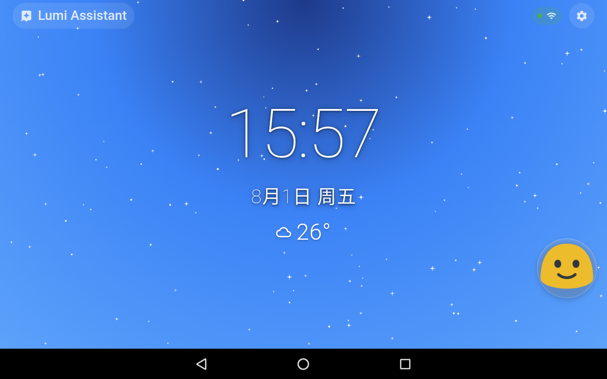
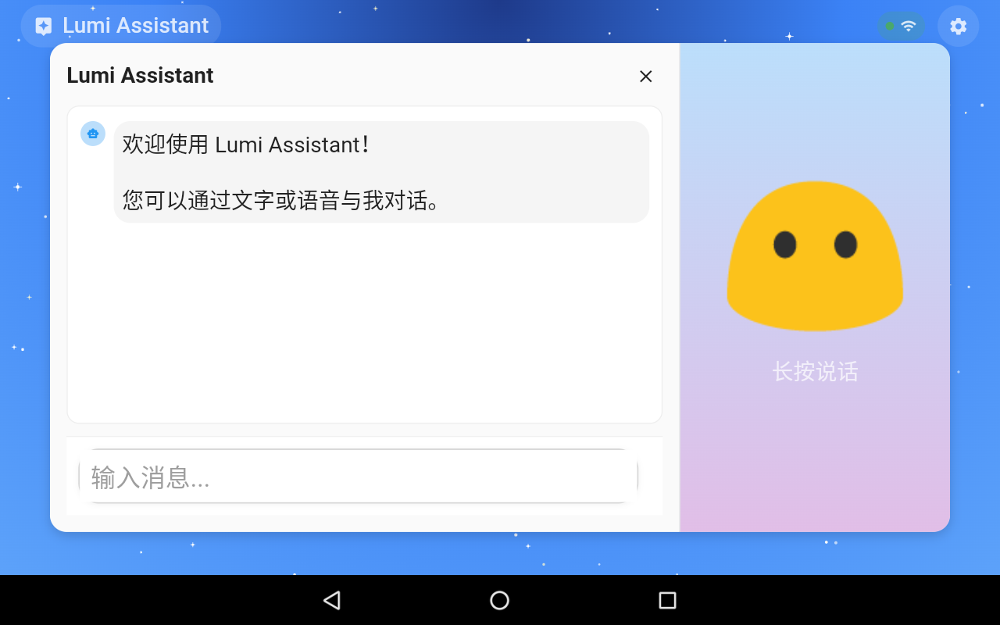
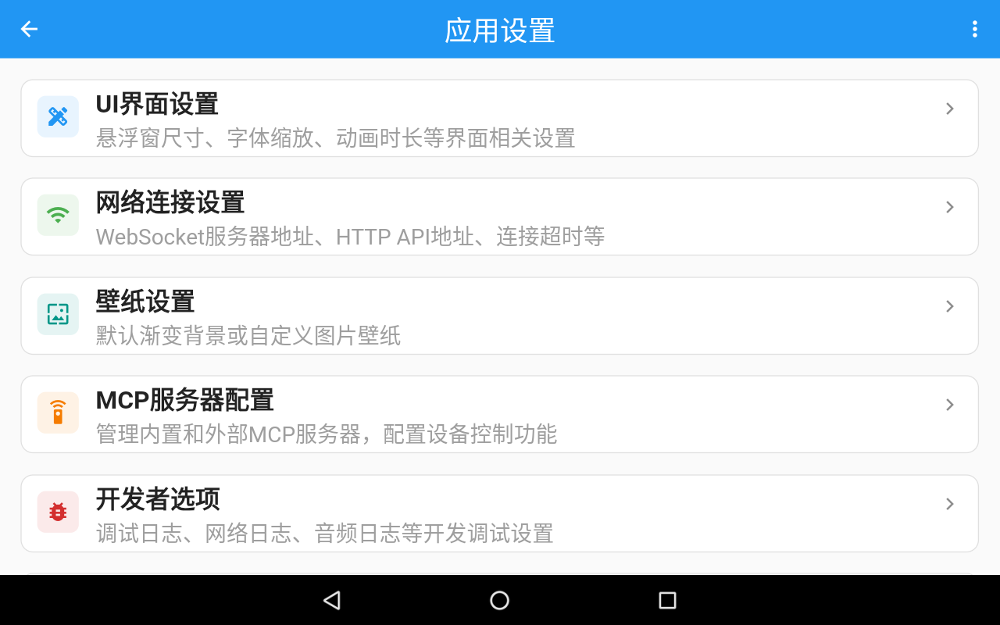
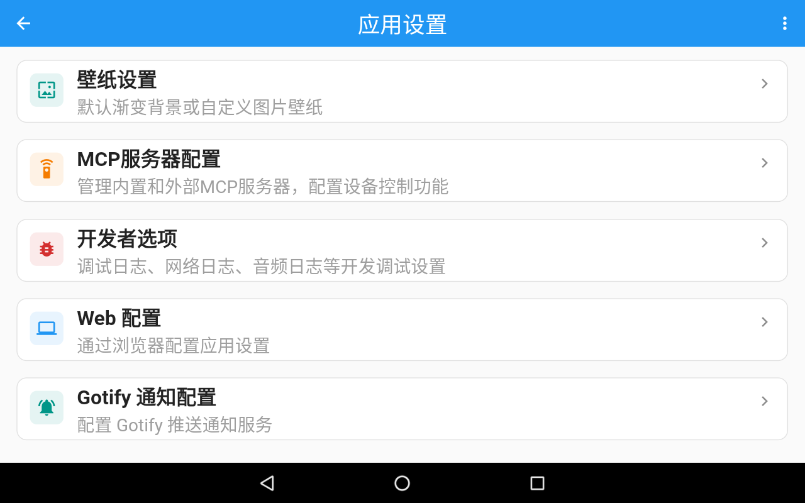

# Lumi Assistant

> 🤖 **打造专属于自己的贾维斯** - 兼容小智(xiaozhi)生态的智能助手

一个基于Flutter开发的智能语音助手客户端，专为**Android 6.0+**设备优化，支持语音交互、桌面信息展示和智能设备控制。让每台闲置设备都能成为你的专属AI助手。

[-green.svg)](https://developer.android.com/about/versions/marshmallow)

---

## 🚧 开发状态

> **⚡ 项目处于非常早期阶段** - 正在快马加鞭进行功能开发

### 🎯 当前进度
- ✅ **语音助手核心功能** - 已基本完成，支持实时语音对话和设备控制
- ✅ **天气信息展示** - 已完成，支持和风天气API，居中天气时钟组件
- ✅ **Gotify通知推送** - 已支持，实时接收服务器推送消息
- ✅ **Web配置界面** - 已实现，支持天气服务配置和其他应用设置
- ✅ **应用设置系统** - 已大幅简化，只保留实用功能配置
- 🔄 **待机桌面背景系统** - 动态星空背景已完成，正在扩展更多样式
- 🔄 **电子相册功能** - 开发中，将支持智能照片轮播
- ⏳ **RSS新闻订阅** - 计划中，个性化资讯推送

> 💡 **早期用户提醒**: 项目处于快速开发迭代中，功能可能不稳定。欢迎体验和反馈！

---

## ✨ 主要功能

### 🎙️ **语音交互**
- 实时语音对话，支持自然打断
- 高质量Opus音频编解码
- 多模态AI集成（语音识别、语言理解、语音合成）

### 🖥️ **桌面待机**
- **天气时钟** - 居中显示时间、日期和天气信息，支持和风天气API
- **动态背景** - 星空动画背景，营造科幻氛围
- **信息中心** - 集成多种信息展示，一目了然
- **电子相册** - 智能照片轮播，展示美好回忆（开发中）
- **新闻资讯** - RSS订阅，实时获取个性化新闻（计划中）

### 🔧 **设备控制**
- 兼容小智(xiaozhi)生态的IoT设备控制
- 音量调节、屏幕亮度等系统控制
- 支持扩展更多智能设备功能

### 🔔 **通知推送**
- **Gotify集成** - 支持自建Gotify服务器推送通知
- **实时接收** - WebSocket长连接，消息即时到达
- **通知管理** - 支持查看历史、标记已读、删除等操作

### ⚙️ **Web配置**
- **无需手动输入** - 通过浏览器扫码或输入地址即可配置
- **实时生效** - 修改设置立即应用，无需重启
- **支持配置项**:
  - 服务器地址和端口
  - 天气服务配置（和风天气API）
  - Gotify推送通知服务
  - UI界面设置（字体缩放、悬浮窗尺寸等）
  - 壁纸和背景设置

### 📱 **超强兼容性**
- **最低支持Android 6.0** (2015年发布)
- 专为老旧设备优化，让闲置手机重获新生
- 原生音频架构，零第三方依赖风险

---

## 🎯 使用场景

| 场景 | 第一阶段功能 | 第二阶段功能 |
|------|--------------|--------------|
| **🏠 智能家居** | 语音控制家电设备 | 环境状态实时展示 |
| **📺 信息中心** | 语音查询天气日程 | 待机展示各类信息 |
| **🖼️ 生活记录** | 语音记录美好时刻 | 智能相册轮播展示 |
| **📰 资讯获取** | 语音播报新闻 | RSS订阅信息展示 |
| **🔔 消息通知** | Gotify推送接收 | 多源通知聚合展示 |
| **♻️ 设备新生** | 语音助手功能 | 桌面信息展示终端 |

---

## 📸 应用截图

### 🏠 主界面 - 天气时钟桌面

*动态星空背景 + 居中天气时钟组件，显示实时时间、日期和天气信息*

### 💬 智能聊天界面

*悬浮式聊天窗口，支持文字和语音对话，兼容小智助手生态*

### ⚙️ 简化设置系统

*只保留实用功能的设置选项：UI界面、网络连接、壁纸、MCP服务器、开发者选项等*

*Web配置和Gotify通知等高级功能设置*

### 🌐 Web配置界面

*通过浏览器扫码或访问地址，轻松配置所有应用设置*

*支持滚动查看完整使用说明，适配各种屏幕尺寸*

---

## 🚀 快速体验

### 安装步骤
**系统要求**: Android 6.0+ 设备
1. 下载最新APK文件
2. 在Android设备上安装
3. 打开应用，点击设置按钮
4. 使用Web配置：
   - 在电脑浏览器访问显示的配置地址
   - 或使用手机扫描二维码
   - 配置服务器地址和Gotify服务（可选）
5. 开始使用语音助手功能

---

## ⚙️ 配置说明

### 🌐 Web配置界面
Lumi Assistant 提供了便捷的Web配置界面，避免手动输入繁琐的设置：

1. **启动配置服务**：在应用设置中点击"Web配置"
2. **访问配置页面**：
   - 扫描二维码直接访问
   - 或在浏览器输入显示的地址（如：`http://192.168.1.100:3000`）
3. **配置项目**：
   - **服务器设置**：xiaozhi后端服务地址和端口
   - **天气服务**：和风天气API密钥、位置设置、更新间隔
   - **Gotify推送**：服务器URL和客户端令牌
   - **界面设置**：字体缩放、悬浮窗尺寸、背景壁纸等
4. **一键应用**：设置立即生效，无需重启应用

### 🌤️ 天气服务配置
应用支持和风天气API，在主界面显示实时天气信息：

1. **获取API密钥**：
   - 访问 [和风天气控制台](https://console.qweather.com/)
   - 注册账号并创建应用获取API Key
2. **配置天气服务**：
   - **位置设置**：使用城市ID（如：101010100代表北京）或经纬度坐标
   - **API密钥**：输入从和风天气获取的密钥
   - **更新间隔**：设置天气数据更新频率（默认30分钟）
3. **城市ID查询**：访问 [城市列表](https://github.com/qwd/LocationList) 查找对应的城市ID
4. **健康监测**：应用会自动检测天气服务状态并在设置中显示

### 🔔 Gotify通知配置
如果你有自建的Gotify服务器，可以接收实时推送通知：

1. **获取客户端令牌**：在Gotify管理界面创建客户端
2. **配置连接信息**：
   - 服务器地址：`http://your-gotify-server.com`
   - 客户端令牌：复制从Gotify获取的token
3. **测试连接**：应用会自动验证配置并显示连接状态
4. **接收通知**：配置成功后即可实时接收推送消息

---

## 🤖 技术优势

### 🏗️ **现代架构**
采用Flutter最新架构模式，使用`hooks_riverpod`状态管理，确保应用响应快速、运行稳定。

### 🎵 **原生音频**
自研Android原生音频播放器，直接使用AudioTrack API，实现极低延迟和高稳定性。

### 🌐 **实时通信**
WebSocket全双工通信，支持文本消息和音频流实时传输，断线自动重连。

### 📱 **超强兼容**
专门优化老设备性能，最低支持2015年的Android 6.0系统，让更多设备受益。

---

## 🤝 生态兼容

本项目完全兼容**小智(xiaozhi)生态**：

- 🔗 **协议兼容** - 遵循xiaozhi WebSocket通信协议
- 🛠️ **工具互通** - 支持MCP协议的IoT设备控制
- 🎯 **功能对齐** - 与ESP32、Android等其他客户端功能一致
- 📡 **服务共享** - 连接相同的Python后端服务

---

## 🛡️ 许可证

本项目采用 MIT 许可证，欢迎自由使用和贡献。

---

## 📞 获取帮助

- **使用问题**: [提交Issue](https://github.com/your-username/lumi-assistant/issues)
- **功能建议**: [参与讨论](https://github.com/your-username/lumi-assistant/discussions)
- **项目源码**: [GitHub仓库](https://github.com/your-username/lumi-assistant)

---

**🤖 打造专属于你的贾维斯，从每台闲置设备开始 🤖**

*"Sometimes you gotta run before you can walk."* - Tony Stark

Made with ❤️ by Flutter Community

